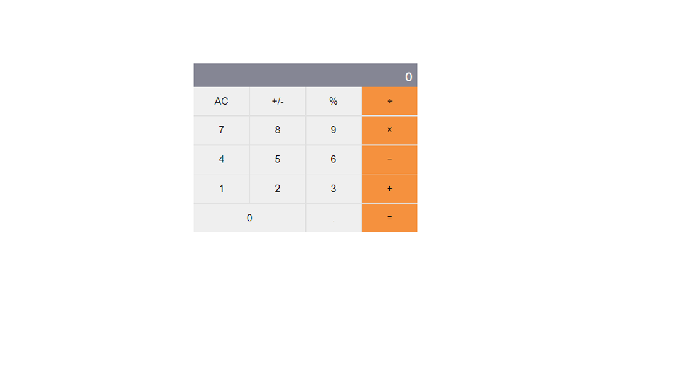

# Math Magicians : Components

> Math magicians is a website for all fans of mathematics. It is a Single Page App (SPA) that allows users to:
- Make simple calculations.
- Read a random math-related quote.


### ScreenShoot



## Built With

- HTML
- CSS 
- JavaScript 
- React
- Linters
- Vscode


## Live Demo

[Live Demo]()

## Getting Started

To get a local copy up and running follow these simple example steps.

### Prerequisites

- Node and NPM
- Web browser (Google chrome)
- Code Editor (VSCode)

### Development (Running locally)

- git clone the project

```bash 
git clone git@github.com:Debas-31/math-magicians
```

- Install Dependencies

```bash
npm install
```

- To run StyleLint by itself, you may run the lint task:

```bash
npx stylelint "**/*.{css,scss}"
```

- Automatically fix issues found (where possible):

```bash
npx stylelint "**/*.{css,scss}" --fix
```
- To fix automatically javaScript issues found
```bash
npx eslint . --fix
```

👤 **Debas Gebreslasie**

- [GitHub](https://github.com/Debas-31)
- [Twitter](https://twitter.com/DEBSH76956492)
- [LinkedIn](https://www.linkedin.com/in/debas-gebrengus)

## 🤝 Contributing

Contributions, issues and feature requests are welcome!

Feel free to check the [issues page](https://github.com/Debas-31/math-magicians-/issues).

## Show your support

Give a ⭐️ if you like this project!

## Acknowledgments

- React Community 

## 📝 License

[MIT licensed]().